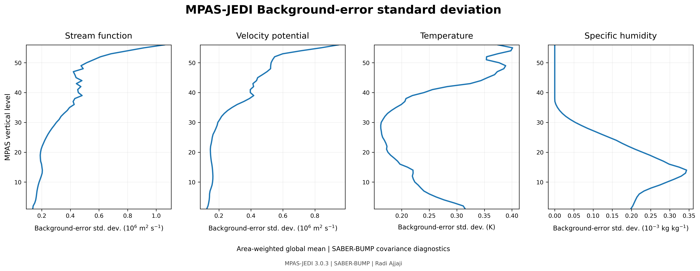
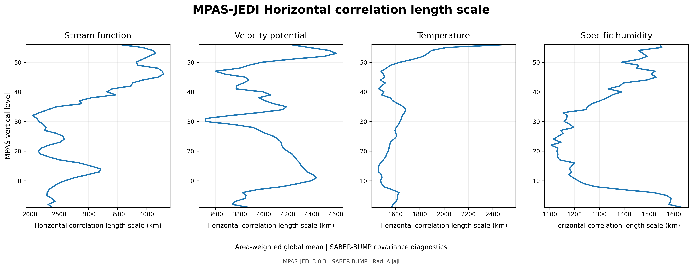
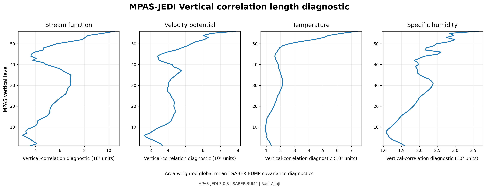
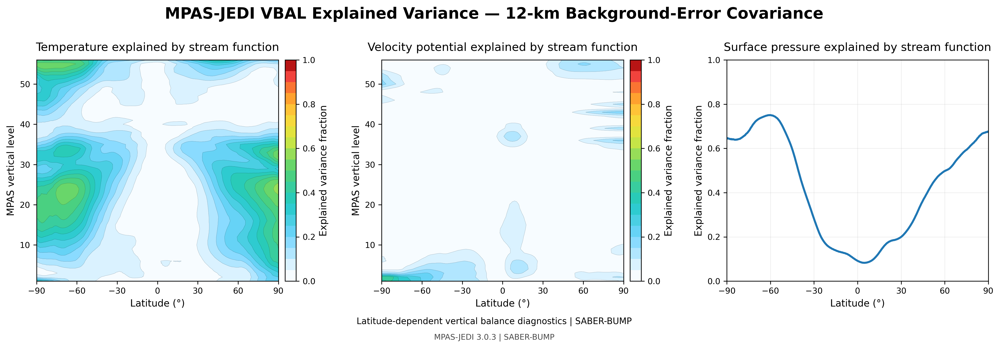
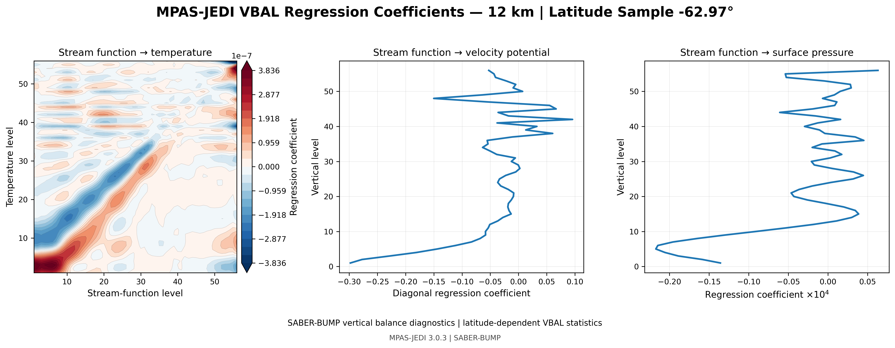
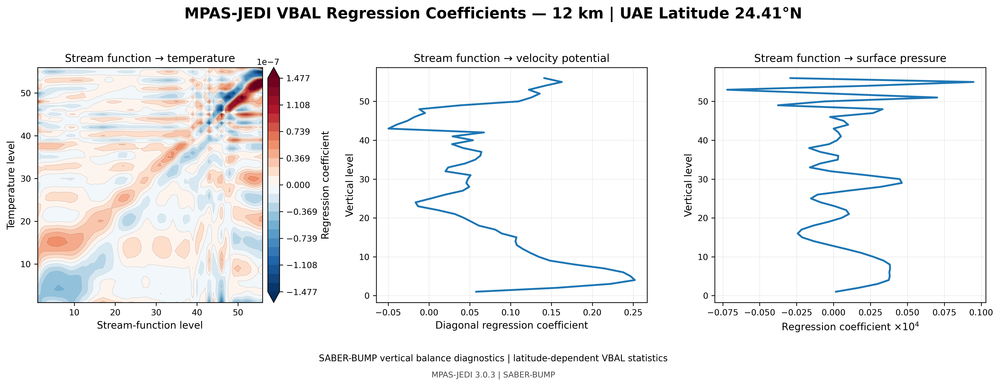

# MPAS-JEDI SABER/BUMP B-Matrix Diagnostics — 12 km

This directory presents selected diagnostics from a native-MPAS
background-error covariance (B-matrix) generated for MPAS-JEDI using
the SABER/BUMP framework on the approximately 12-km global MPAS mesh.

The complete covariance dataset is much too large for GitHub.
Only selected diagnostic figures are included here.

## Diagnostic components

The figures illustrate several important components of the trained
background-error covariance:

- background-error standard deviations;
- horizontal correlation structures;
- vertical correlation structures;
- vertical-balance (VBAL) explained variance;
- vertical-balance regression coefficients.

## Standard deviations

The standard-deviation diagnostic shows the spatial and vertical
magnitude of the background-error variability represented by the
trained covariance.

## Horizontal correlations

Horizontal correlation diagnostics characterize the spatial extent
over which analysis increments are spread by the covariance model.

## Vertical correlations

Vertical correlation diagnostics describe the coupling between model
levels and provide an important view of the vertical structure learned
from the training ensemble/sample set.

## Vertical balance — explained variance

The VBAL explained-variance diagnostic quantifies the fraction of
variance represented through the statistical balance relationships
estimated during BUMP calibration.

## Vertical balance — regression coefficients

Example regression structure:

A second example is shown for a location over the UAE region:

These diagnostics illustrate how statistically balanced responses
between control variables vary vertically and geographically.

## Notes

These figures are diagnostic products from the covariance-training
workflow and are intended for scientific inspection and comparison.

The full distributed NICAS/BUMP covariance files are not included in
this repository because of their very large storage requirements.
