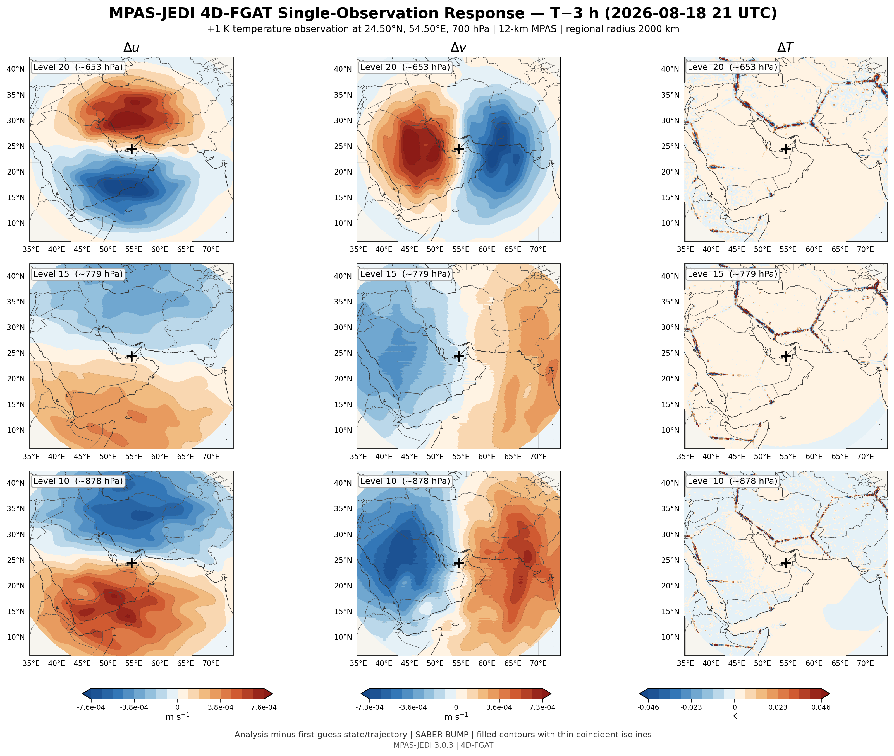
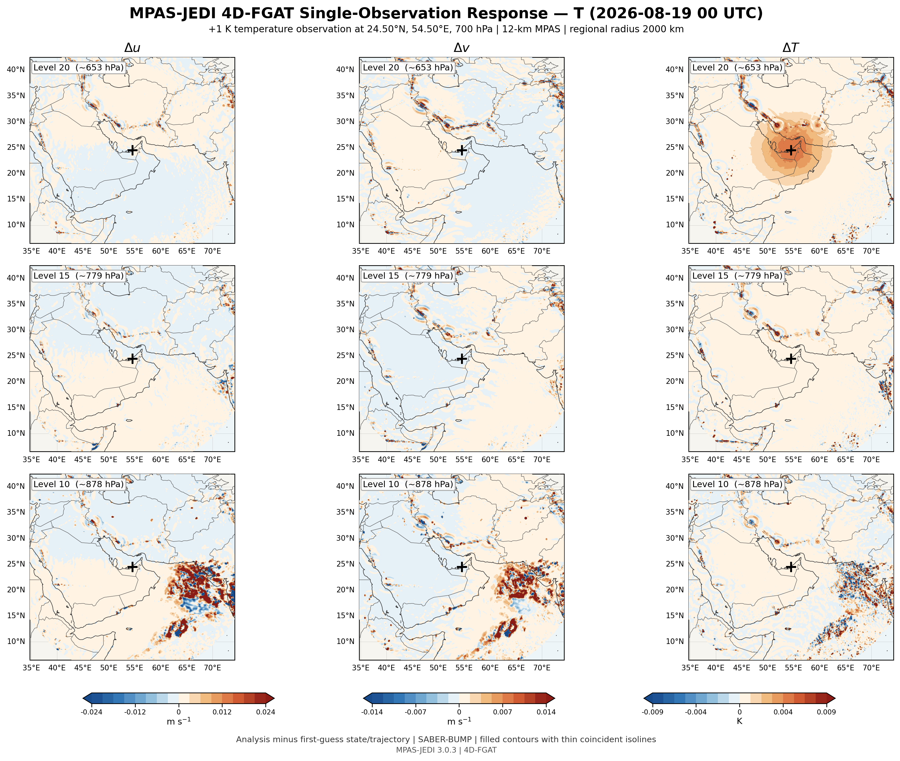
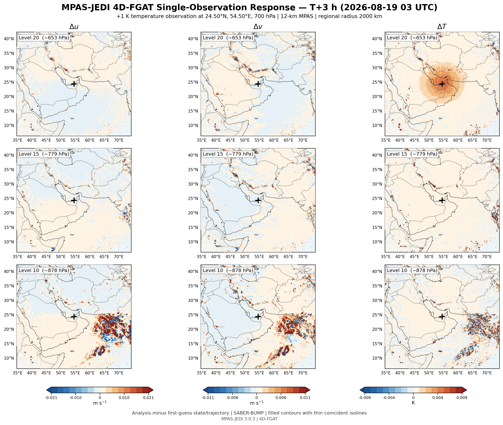
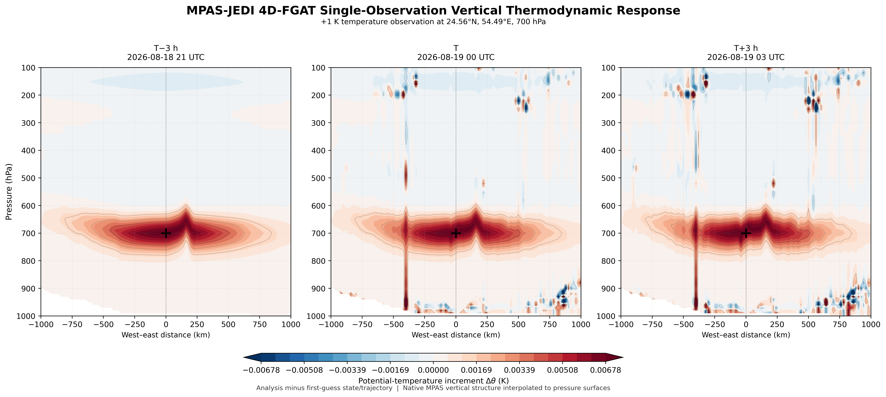
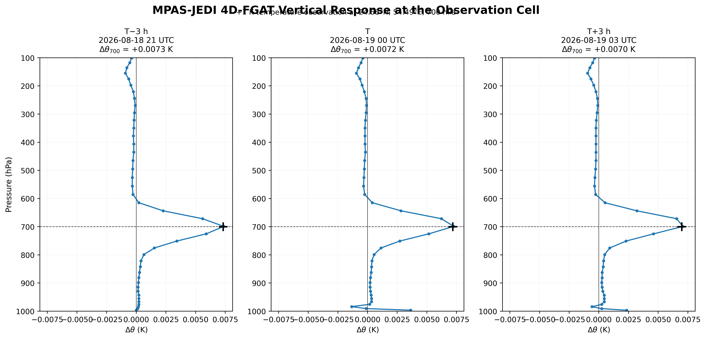
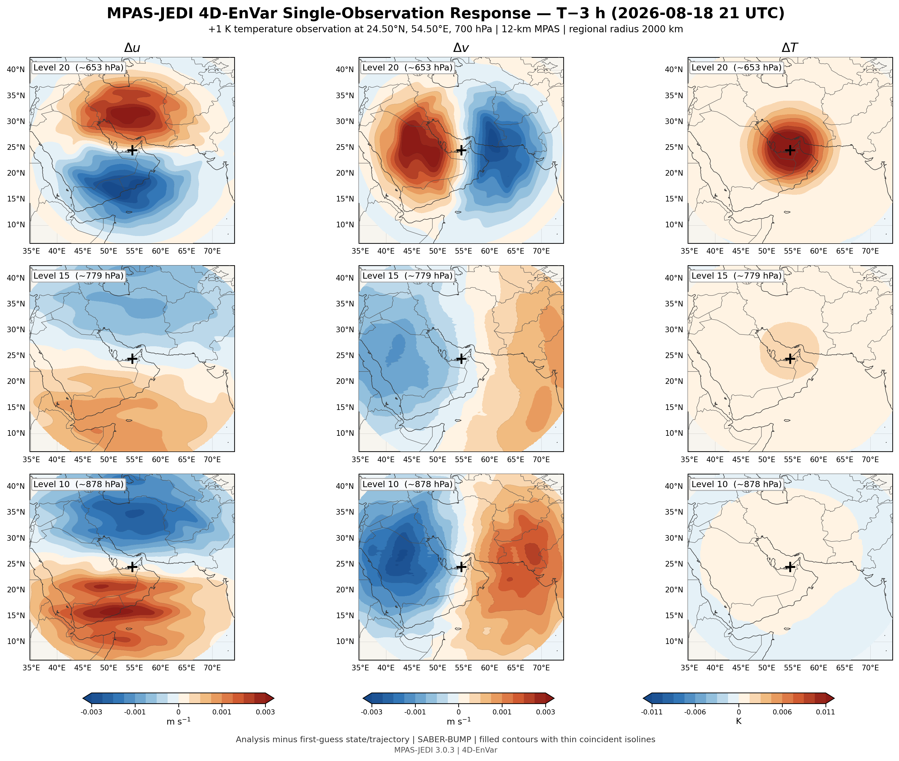
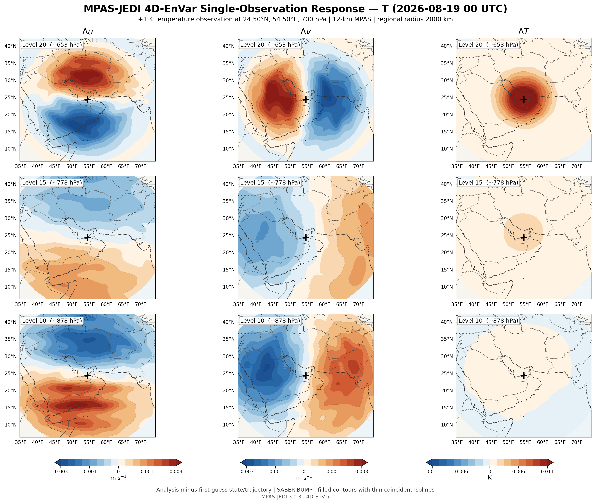
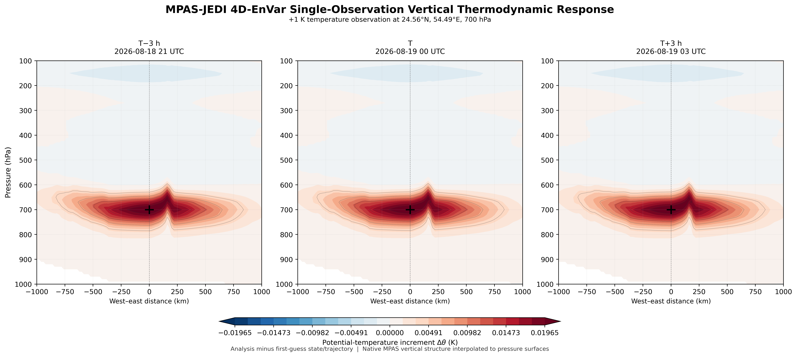
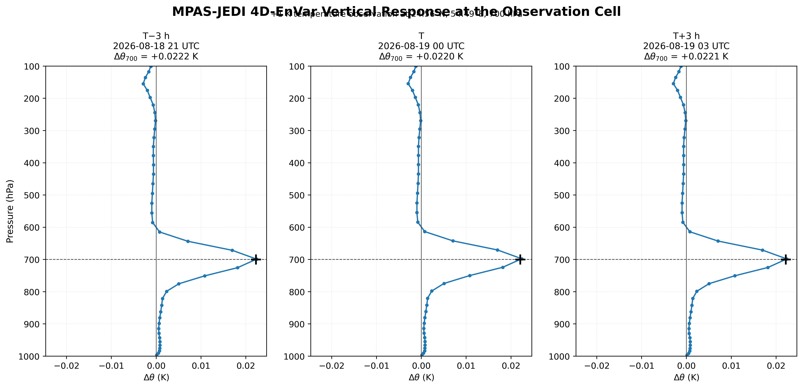

# MPAS-JEDI Single-Observation Experiments — 2026-08-19 00 UTC

This example presents selected single-observation experiments performed
with MPAS-JEDI to examine the spatial, vertical and temporal response
of the variational data-assimilation system to an isolated temperature
observation.

The experiment provides a controlled way to inspect how the background
error covariance and the four-dimensional assimilation formulation
distribute information away from a single observation.

Two assimilation configurations are shown here:

- 4D-FGAT
- 4D-EnVar

The figures include horizontal analysis-increment structures,
vertical sections, vertical profiles and temporal evolution across
the assimilation window.

## 4D-FGAT

### T - 3 h

### Analysis time

### T + 3 h

### Vertical structure

A publication-oriented native-level representation is also available:

[4D-FGAT native-level temperature figure (PDF)](figures/4d-fgat/SO_4DFGAT_NATIVELEVEL_T_PUBLICATION.pdf)

## 4D-EnVar

### T - 3 h

### Analysis time

### T + 3 h

### Vertical structure

A publication-oriented native-level representation is also available:

[4D-EnVar native-level temperature figure (PDF)](figures/4d-envar/SO_4DENSVAR_NATIVELEVEL_T_PUBLICATION.pdf)

## Cross-method comparison

A combined native-level temperature comparison is provided here:

[Single-observation native-level comparison — all available modes (PDF)](figures/comparison/SingleObservation_NATIVELEVEL_T_ALL_MODES.pdf)

The comparison is useful for examining differences in increment
structure associated with the different variational formulations.

## Purpose

Single-observation experiments are especially useful for verifying:

- the effective horizontal length scales of the covariance;
- the vertical propagation of observational information;
- multivariate and balanced responses;
- temporal propagation within four-dimensional assimilation;
- differences between static and ensemble-dependent covariance
  formulations.

These experiments are diagnostic tests and should not be interpreted
as an assessment of forecast skill from a full observing network.
